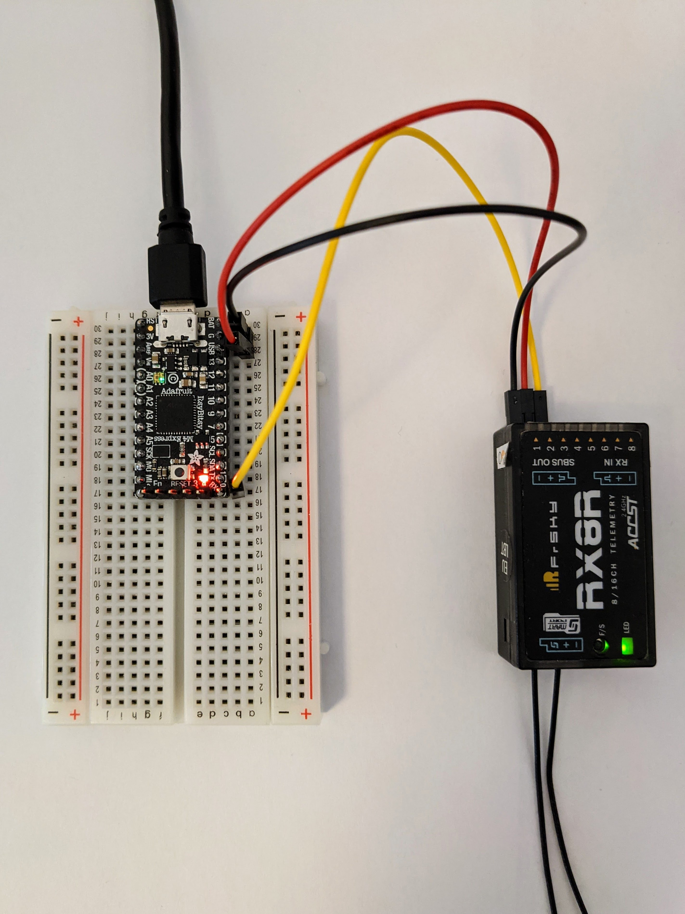
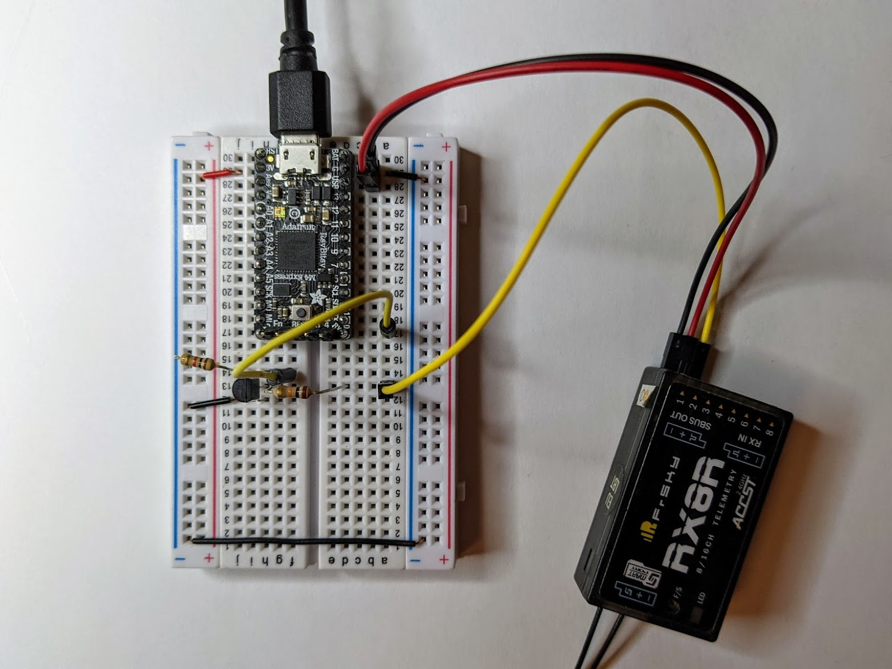
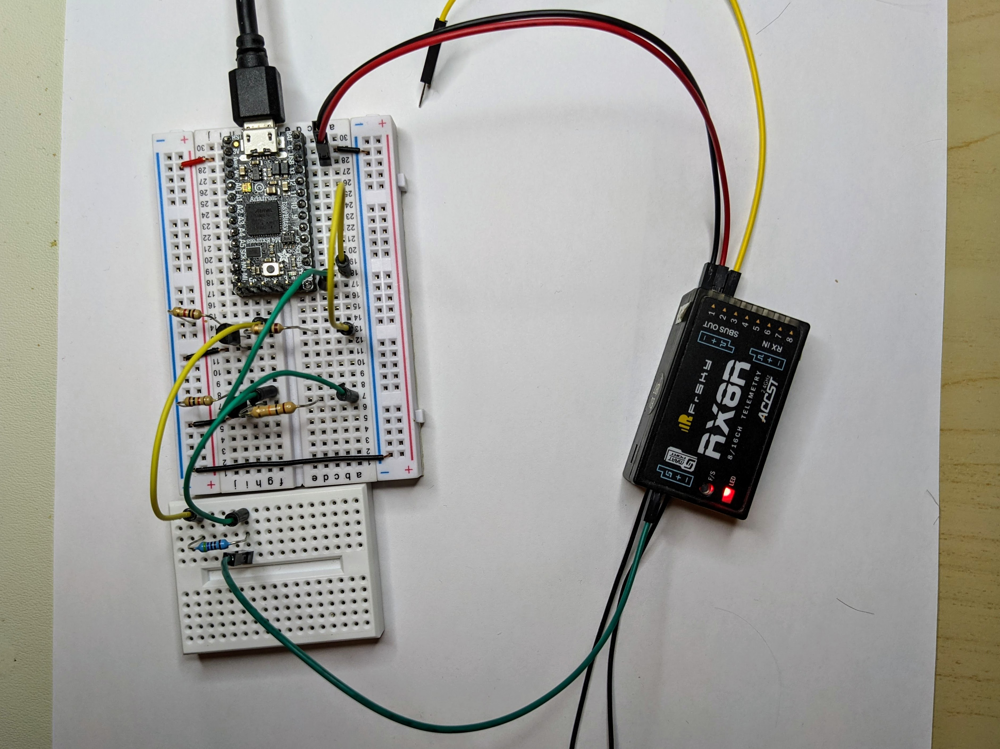

Updgrading the bootloader and CircuitPython
-------------------------------------------

The main ItsyBitsy M4 Express [guide](https://learn.adafruit.com/introducing-adafruit-itsybitsy-m4?view=all) says you simply have to double-click the boards _RESET_ button to get it to enter bootloader mode (if the board is currently running CircuitPython rather than something Arduino based).

I found that the board ignored all presses of the _RESET_ button and that I had to connect to the board and get to the Python prompt (i.e. ctrl-C or simply _Enter_ depending on whether you're still running a Python program or not), then I could double click but it took a few tries to get the click speed just right.

Note: oddly, even with 6.1 CircuitPython, I find that pressing ctrl-C does terminate the current program but doesn't necessarily return my to the Python prompt:

```
KeyboardInterrupt: 

Code done running.
```

I have to press ctrl-C again to get to the prompt.

It turns out my ItsyBitsy was running an ancient version of the bootloader:

```
$ cat /media/$USER/ITSYM4BOOT/INFO_UF2.TXT 
UF2 Bootloader v2.0.0-adafruit.7 SFHWRO
Model: ItsyBitsy M4 Express
Board-ID: SAMD51G19A-Itsy-v0
```

So the double-click issue just seems to have been down to this - after updating it worked as expected.

I downloaded the latest bootloader from the ItsyBitsy M4 Express [CircuitPython page](https://circuitpython.org/board/itsybitsy_m4_express/) and copied it over:

```
$ cp ~/Downloads/update-bootloader-itsybitsy_m4-v3.10.0.uf2 /media/$USER/ITSYM4BOOT
$ cat /media/$USER/ITSYM4BOOT/INFO_UF2.TXT 
UF2 Bootloader v3.10.0 SFHWRO
Model: ItsyBitsy M4 Express
Board-ID: SAMD51G19A-Itsy-v0
```

Note: the `cp` was almost instantaneous, but then nothing seems to happen and then the board blinks away for a few seconds before restarting back into bootloader mode. The board no longer has CircuitPython, so it'll always start into bootloader mode on pressing _RESET_ once.

Then I downloaded the latest CircuitPython releases (from the same page as the bootloader) and copied it on:

```
$ cp ~/Downloads/adafruit-circuitpython-itsybitsy_m4_express-en_US-6.1.0.uf2 /media/$USER/ITSYM4BOOT
$ cat /media/$USER/CIRCUITPY/boot_out.txt
Adafruit CircuitPython 6.1.0 on 2021-01-21; Adafruit ItsyBitsy M4 Express with samd51g19
```

This time it restarted in CircuitPython mode.

Basic S.BUS input
-----------------

Once ready to go, I wired up an X-series FrSky RX to the GND, USB (i.e. 5V out) and RX pins of the ItsyBitsy, like so:



And then confirmed, I could see data coming from the RX with this little program (slightly adapted from code found in the CircuitPython [UART guide](https://learn.adafruit.com/circuitpython-essentials/circuitpython-uart-serial)):

```Python
import board
import busio
 
uart = busio.UART(board.TX, board.RX, baudrate=100000)
 
while True:
    if data is not None:
        # convert bytearray to string
        data_string = ''.join([chr(b) for b in data])
        print(data_string, end="")
```

Note: the RX only starts outputting data once connected to my Taranis TX - once that happens it outputs continuously, i.e. irrespective of whether you move the sticks etc. Once it has started outputting it continues even if the TX is then turned off.

Aside: it's not helpful that RX and TX are used to mean two different sets of things here, either the RX and TX pins of a UART or the FrSky receiver and transmitter. 

Inverted S.BUS input
--------------------

TODO: get rid of the section above - it doesn't make any sense to talk about whether S.BUS transmits data when the TX is on or off if you're not looking at a meaningful signal.



TODO: provide details of resistors and transistor.

Python
------

Setup a Python venv:

```
$ python3 -m venv env
$ source env/bin/activate
(env) $ pip install --upgrade pip
```

Bidirectional S.PORT
--------------------

Initially I made the mistake of connecting the TX pin via a resistor to the RX pin and then connecting that pin to a single transistor setup.

But obviously, the transistor isn't bidirectional - so you need two, one to invert the TX signal from the X8R and one to invert the TX signal from the ItsyBitsy.

And then treat the inverted RX and TX on the daughter breadboard as the "real" RX and TX pins and connect the TX here, via a 4.7k&ohm; resistor to the RX and then onto the S.PORT signal pin.


